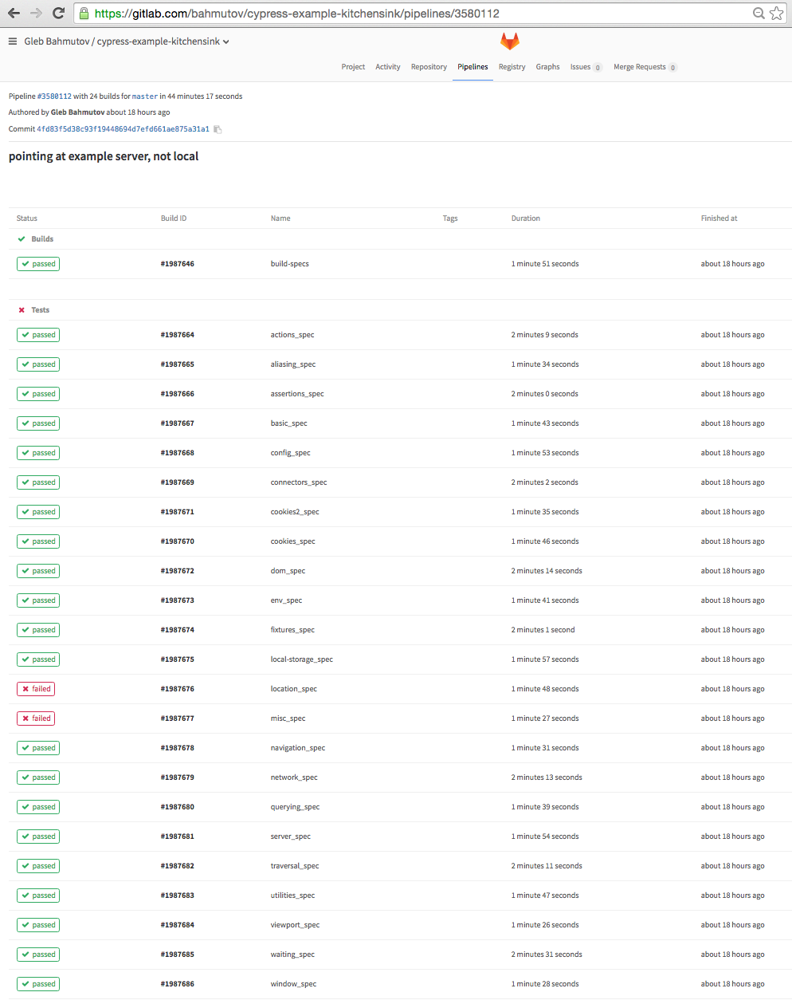

# multi-cypress

> Roll multiple spec bundles and test in parallel using Cypress and GitLab

[![NPM][npm-icon] ][npm-url]

[![Build status][ci-image] ][ci-url]
[![semantic-release][semantic-image] ][semantic-url]
[![js-standard-style][standard-image]][standard-url]

## Goals

This is a built utility for making and running [Cypress](https://www.cypress.io/)
tests on a GitLab instance.

* Generate single output spec files from multiple input files using ES6 module syntax 
  (`import` and `export` statements)
* Create a GitLab definition file that allows running multiple spec files in parallel.

You can see an example in action at 
[gitlab](https://gitlab.com/bahmutov/cypress-example-kitchensink) where multiple testing
jobs are built and executed in parallel.



## Install and use

Imagine you have multiple spec files in `tests` folder. Each spec file can include
other files using `import` statements. Install this tool `npm i -D multi-cypress`
and use it to build the spec bundles and `.gitlab-ci.yml` file.

```json
{
  "name": "my-module",
  "scripts": {
    "build": "multi-cypress"
  }
}
```

You can watch the input spec files and keep rebuilding the bundles and `.gitlab-ci.yml`
file on changes.

```json
{
  "name": "my-module",
  "scripts": {
    "build": "multi-cypress -w"
  }
}
```

### Custom configuration

You can define input spec file pattern and output folder inside `package.json`.
See [test/package.json](test/package.json) for an example

```json
{
  "name": "my-module",
  "config": {
    "multi-cypress": {
      "specs": "src/*-spec.js",
      "destination": "output"
    }
  }
}
```

## Output .gitlab-ci.yml file

The output file will have single build job and multiple test jobs (single test job per output spec
file). See the generated test example [test/.gitlab-ci.yml](test/.gitlab-ci.yml).
You can specify the base docker image to use (which should probably include everything
Cypress needs to run). By default, it sets the base image to 
[bahmutov/cypress-image](https://hub.docker.com/r/bahmutov/cypress-image/) which includes
everything Cypress needs to run plus Node 6.

```json
{
  "name": "my-module",
  "config": {
    "multi-cypress": {
      "specs": "src/*-spec.js",
      "docker": "my-company-hub/test/cypress-base"
    }
  }
}
```

You can disable `.gitlab-ci.yml` file generation using a config option

```json
{
  "name": "my-module",
  "config": {
    "multi-cypress": {
      "gitlab": false
    }
  }
}
```

## Custom test commands

By default, each GitLab test job only runs a single default command

```
cypress ci --spec "${outputFolder}/$CI_BUILD_NAME.js"
```

where `outputFolder` is either the default folder or the one specified in the `package.json`,
and `CI_BUILD_NAME` is the environment variable set by the GitLab CI. You can set your own
test and after test commands, for example to specify the 
[json reporter](https://github.com/cypress-io/cypress-cli#cypress-run-1) we could do

```json
"config": {
  "multi-cypress": {
    "destination": "cypress/integration",
    "script": [
      "cypress ci --spec cypress/integration/$CI_BUILD_NAME.js --reporter json",
      "echo test finished successfully"
    ]
    "after_script": [
      "echo All done!"
    ]
  }
}
```

Note that in this case you need to form the full test filename yourself, without relying on
macro expansion `${outputFolder}`. See [test4/package.json](test4/package.json) and
[test4/.gitlab-ci.yml](test4/.gitlab-ci.yml) for examples.

## Debugging

To print debug messages during the build, start the tool with environment variable

```
DEBUG=multi ...
```

The generated GitLab CI also collects the screenshots collected by Cypress as artifacts

```
.job_template: &e2e_test_definition
  artifacts:
    when: on_failure
    expire_in: 1 month
    paths:
    - cypress/screenshots/
  script:
    - cypress ci --spec "output/$CI_BUILD_NAME.js"
```

This should help debug test problems, because Cypress should save the screenshots on failure
when running in the CI mode.

### Small print

Author: Kensho, Gleb Bahmutov &lt;gleb@kensho.com&gt; &copy; 2016

License: MIT - do anything with the code, but don't blame me if it does not work.

Support: if you find any problems with this module, email / tweet /
[open issue](https://github.com/kensho/multi-cypress/issues) on Github

## MIT License

Copyright (c) 2016 Kensho

Permission is hereby granted, free of charge, to any person
obtaining a copy of this software and associated documentation
files (the "Software"), to deal in the Software without
restriction, including without limitation the rights to use,
copy, modify, merge, publish, distribute, sublicense, and/or sell
copies of the Software, and to permit persons to whom the
Software is furnished to do so, subject to the following
conditions:

The above copyright notice and this permission notice shall be
included in all copies or substantial portions of the Software.

THE SOFTWARE IS PROVIDED "AS IS", WITHOUT WARRANTY OF ANY KIND,
EXPRESS OR IMPLIED, INCLUDING BUT NOT LIMITED TO THE WARRANTIES
OF MERCHANTABILITY, FITNESS FOR A PARTICULAR PURPOSE AND
NONINFRINGEMENT. IN NO EVENT SHALL THE AUTHORS OR COPYRIGHT
HOLDERS BE LIABLE FOR ANY CLAIM, DAMAGES OR OTHER LIABILITY,
WHETHER IN AN ACTION OF CONTRACT, TORT OR OTHERWISE, ARISING
FROM, OUT OF OR IN CONNECTION WITH THE SOFTWARE OR THE USE OR
OTHER DEALINGS IN THE SOFTWARE.

[npm-icon]: https://nodei.co/npm/multi-cypress.png?downloads=true
[npm-url]: https://npmjs.org/package/multi-cypress
[ci-image]: https://travis-ci.org/kensho/multi-cypress.png?branch=master
[ci-url]: https://travis-ci.org/kensho/multi-cypress
[semantic-image]: https://img.shields.io/badge/%20%20%F0%9F%93%A6%F0%9F%9A%80-semantic--release-e10079.svg
[semantic-url]: https://github.com/semantic-release/semantic-release
[standard-image]: https://img.shields.io/badge/code%20style-standard-brightgreen.svg
[standard-url]: http://standardjs.com/
